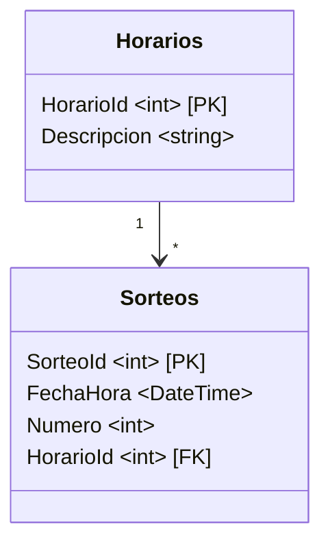

# Caso Práctico 2

| Curso                         | Programación Avanzada en Web  |
| :---------------------------- | :---------------------------- |
| Código                        | SC-701                        |
| Profesor                      | Luis Andrés Rojas Matey       |
| Fecha y hora de entrega final | Martes 5 de agosto a las 9 pm |
| Valor                         | 15 %                          |

<br />

## Especificaciones generales

El _Solution_ contiene 3 _Projects_ hechos con el _Framework_ `.NET 8.0`, los cuales no tienen relación entre sí, es decir, son independientes:

- **CF**: una aplicación de Consola que utiliza la herramienta `Entity Framework 9.0` con la estrategia _Code First_.
- **DI**: una aplicación web con arquitectura MVC (_Model-View-Controller_) que utiliza _Dependency Injection_.
- **UT**: una aplicación con _Unit Tests_.

En cada _Project_ se deben trabajar 5 secciones:

- **_Errors_**: arreglar los errores de compilación.
- **_Warnings_**: arreglar las advertencias de compilación.
- **_Fix_**: arreglar el error de ejecución.
- **_Update_**: incluir un nuevo componente o lógica de ejecución.
- **_Improvement_**: mejorar algún componente o lógica de ejecución.

Los **_Errors_** sin arreglar no permiten la ejecución del _Project_, por lo que esto es lo primero que se debe resolver.

Los **_Warnings_** sin arreglar permiten la ejecución del _Project_, pero también se deberían resolver; es decir, durante la compilación no se debería mostrar ningún error o advertencia. Se recomienda utilizar la opción `--no-incremental` durante la compilación para que siempre se muestren dichas advertencias:

```
$ dotnet build --no-incremental
```

<br />

## CF

Esta aplicación contiene lo necesario para crear y utilizar una base de datos `SQLite` llamada `tiempos.db` en la carpeta `data`. En esta misma carpeta se encuentra un archivo CSV (_Comma-Separated Values_), llamado `tiempos.csv`, que tiene los números ganadores del juego de azar [**Nuevos Tiempos Reventados** de la Junta de Protección Social](https://www.jps.go.cr/resultados/nuevos-tiempos-reventados) desde el año 2022 a la fecha, el cual se juega tres veces al día. Estas son las primeras líneas de dicho archivo:

```csv
Horario,Fecha,Sorteo,Numero
manana,2022-06-06T12:55:00,19390,8
mediaTarde,2022-06-06T16:30:00,19391,83
tarde,2022-06-06T19:30:00,19392,59
manana,2022-06-07T12:55:00,19393,18
mediaTarde,2022-06-07T16:30:00,19394,57
...
```

Debido a que esta aplicación utiliza `Entity Framework`, lo primero que se debe hacer una vez que el programa compila correctamente (sin errores), es generar la base de datos. Esto se hará con la estrategia _Code First_ usando el _Context_ que está definido en el archivo `Tiempos.cs`. Así, se debería primeramente ejecutar lo siguiente:

```bash
$ dotnet build
...
$ dotnet ef migrations add InitialCreate
...
$ dotnet ef database update
```

Específicamente, este es el esquema según las `Entities` definidas:



Notar que al final de todos los cambios en este _Project_, la carpeta `data` debería contener los siguientes archivos:

- `tiempos.csv`
- `tiempos.db`
- `2022.csv`
- `2023.csv`
- `2024.csv`
- `2025.csv`
- `2022.tsv`
- `2023.tsv`
- `2024.tsv`
- `2025.tsv`

### _Fix_

Arregle el programa para que al ejecutarse, este corra los métodos `CargarDatos` y `GuardarDatos` definidos en el archivo `Program.cs`, en ese orden, en cada corrida. Así, la primera vez que se ejecuta, se cargarán los datos en la base de datos y se guardarán varios archivos CSV en la carpeta `data`:

```bash
$ dotnet run

Cargando datos... Listo.

Guardando datos... Listo.
```

La segunda y posteriores veces que se ejecuta, solo guardará los archivos CSV:

```bash
$ dotnet run

Datos ya fueron cargados

Guardando datos... Listo.
```

Los archivos CSV están divididos por año del sorteo y dentro de cada uno se halla los datos de dichos juegos. Ejemplo:

```csv
Fecha,Horario,Sorteo,Numero
2025-01-02,manana,22165,33
2025-01-02,mediaTarde,22166,42
2025-01-02,tarde,22167,76
2025-01-03,manana,22168,48
2025-01-03,mediaTarde,22169,32
...
```

<br />

### _Update_

Actualice el método `GuardarDatos` del archivo `Programa.cs` para que también guarde los mismos datos en archivos [TSV (_Tab-Separated Values_)](https://en.wikipedia.org/wiki/Tab-separated_values), con extensión `.tsv`. Estos son similares a los CSV excepto que utiliza [_tabs_](https://es.wikipedia.org/wiki/Tabulador) (`\t`) en vez de comas (`,`) para separar los valores. Ejemplo:

```tsv
Fecha Horario Sorteo  Numero
2025-01-02  manana  22165 33
2025-01-02  mediaTarde  22166 42
2025-01-02  tarde 22167 76
2025-01-03  manana  22168 48
2025-01-03  mediaTarde  22169 32
...
```

<br />

### _Improvement_

Mejore el método `GuardarDatos` del archivo `Programa.cs` para que los datos que se guardarán en los archivos CSV y TSV sean ordenados por fecha de forma descendente.

<br />

## DI

Esta aplicación web muestra una página con la hora actual y un par de números aleatorios: uno entero y otro flotante.

<br />

### _Fix_

Arregle el _Action_ `Index` del `HomeController` (en la carpeta `Controllers`) para que el parámetro que recibe (del tipo `IFechaHora`) sea desde los _Services_.

<br />

### _Update_

Actualice la _Class_ `FechaHoraUtc` (en la carpeta `Services`) para que implemente la _Interface_ `IFechaHora` (de la carpeta `Interfaces`) y, al obtener su _Property_ `Actual`, este retorne el _DateTime_ correspondiente al [**UTC**](https://es.wikipedia.org/wiki/Tiempo_universal_coordinado) actual.

<br />

### Improvement

Sustituya, en el _Service Collection_, la implementación del _Service_ del tipo `IFechaHora`, para que utilice la _Class_ `FechaHoraUtc` en vez de `FechaHoraLocal`.

<br />

## UT

Este _Project_ contiene una implementación parcial de una calculadora binaria (archivo `BinaryCalculator.cs`) y los _Unit Tests_ (archivo `UnitTests.cs`) que prueban los métodos de dicha calculadora.

Dicha implementación utiliza _Strings_ como parámetros que corresponden a la representación binaria de números naturales (en base 10 o decimal). Ejemplo: `"10001"` para el número **17**.

A modo de ayuda, se despliega en Consola un _Trace_ con algunos valores cuando los _Unit Tests_ son ejecutados. Ejemplo:

```bash
$ dotnet test
...
Suma: 11 y 111
FromBinToDec: 11 -> 3
FromBinToDec: 111 -> 7
FromDecToBin: 10 -> 1010
TresMasSiete: 1010

Resta: 111 y 11
FromBinToDec: 111 -> 7
FromBinToDec: 11 -> 3
FromDecToBin: 4 -> 100
SieteMenosTres: 100
...
```

<br />

### _Fix_

Arregle la implementación del método `Resta` de la calculadora para que retorne el resultado de la resta de los valores de `a` y `b` correctamente (`a - b`).

<br />

### _Update_

Actualice el método `Multi` de la calculadora para que retorne el resultado de la multiplicación de los valores de sus parámetros (`a * b`).

<br />

### _Improvement_

Agregue un _Unit Test_ llamado `QuinceEntreCinco` que valide el método `Div` de la calculadora. Para esto, utilice como parámetros los valores binarios correspondientes a los números naturales (en base decimal) de **15** y **5**, donde el resultado esperado de dicha división sea el valor binario correspondiente al entero **3** (`15 / 5 = 3`).

<br />

## Rúbrica de evaluación

|                   | **EF** | **UT** | **DI** |
| ----------------: | :----: | :----: | :----: |
|      **_Errors_** |   1    |   1    |   1    |
|    **_Warnings_** |   1    |   1    |   1    |
|         **_Fix_** |   1    |   1    |   1    |
|      **_Update_** |   1    |   1    |   1    |
| **_Improvement_** |   1    |   1    |   1    |
|       **Totales** | **5**  | **5**  | **5**  |

<br />

## Entregables

Un único archivo comprimido **ZIP** con el siguiente nombre: `CP2-[Carné].zip`. Ejemplo de nombre del archivo **ZIP**: `CP2-FH12345678.zip`.

Si el archivo comprimido no es del tipo correcto (**ZIP**) o el nombre del archivo no está en el formato correcto, entonces se evaluará como "no entregado".

El mismo (archivo comprimido **ZIP**) debe contener todo el código fuente que incluya el archivo _Solution_ y las carpetas de los _Projects_. Sin embargo, no debe contener los archivos compilados, es decir, excluir las carpetas `bin` y `obj`.

El código fuente debe incluir, en forma de comentarios, de dónde obtuvo la respuesta/implementación, ya sea el vínculo (_link_) de una página o el nombre del _chatbot_. Ejemplos:

```js
// https://mathworld.wolfram.com/TribonacciNumber.html

// Gemini
```
