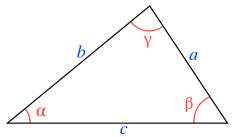
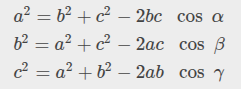
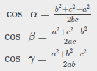

# Tarea Programada 2

| Curso                           | Programación Avanzada en Web     |
| :------------------------------ | :------------------------------- |
| Código                          | SC-701                           |
| Profesor                        | Luis Andrés Rojas Matey          |
| Fecha y hora de entrega inicial | Martes 3 de junio a las 9:00 pm  |
| Fecha y hora de entrega final   | Martes 10 de junio a las 6:00 pm |

 

## Introducción

Como parte de la [geometría euclidiana](https://es.wikipedia.org/wiki/Geometr%C3%ADa_euclidiana) están los **triángulos**. Estos son figuras geométricas con múltiples características y propiedades (como fórmulas matemáticas) que combina unidades lineales (longitud de los lados) y ángulos (formados al combinar dos de sus lados). Gracias a estos, nació la [trigonometría](https://es.wikipedia.org/wiki/Trigonometr%C3%ADa).

 

## Objetivo

Aplicar los aprendido hasta ahora respecto a `ASP.NET Core MVC` con el _framework_ `.NET 8.0`.

 

## Especificaciones funcionales

Al ser un programa en `ASP.NET Core MVC`, este se ejecutará en un navegador web. Al mostrarse la página web, debe contener un formulario para que el usuario pueda indicar tres unidades numéricas que representarán las longitudes de los tres lados de un triángulo. Por lo tanto, este formulario debe tener al menos estos elementos:

- Tres etiquetas que identifiquen los lados. Estos deben ser con las letras minúsculas `a`, `b` y `c`.

- Tres campos donde el usuario pueda ingresar los 3 valores numéricos que representan las unidades lineales de la longitud de cada uno de los lados.

- Un botón de _submit_ para ponder enviar el **HTTP POST** (_request_) con la información al servidor.

Una vez que el usuario cliquea el botón de _submit_, deben ejecutarse estos 3 pasos en el mismo orden:

1. Validar los datos introducidos

2. Calcular el perímetro, el semiperímetro, el área e indicar el tipo

3. Calcular los ángulos

 

### Validar los datos introducidos

Dos validaciones específicas deben ejecutarse, dependiendo la segunda de la validez de la primera:

1. Los tres valores introducidos deben ser mayores que cero (0). Esto se debe validar utilizando _annotations_ en el _model_ que tendrá al menos 3 _properties_ (para cada uno de los lados).

2. La suma de los dos valores menores debe ser mayor que el tercer valor. Esto es para verificar que cumple con la [desigualdad triángular](https://es.wikipedia.org/wiki/Desigualdad_triangular). Esta validación la puede ejecutar en la capa que considere oportuna.

Si cualquiera de las dos validaciones anteriores falla, debe informarse al usuario por medio de uno o varios mensajes en la página.

 

### Calcular el perímetro, el semiperímetro, el área e indicar el tipo

Si las validaciones "pasaron", entonces se deben calcular tres valores del triángulo: el perímetro (representado como `P`), el semiperímetro (`S`) y el área (`A`), este último utilizando la [fórmula de Herón](https://es.wikipedia.org/wiki/F%C3%B3rmula_de_Her%C3%B3n). Tanto el perímetro como el semiperímetro se presentan como **unidades lineales** (`u`), mientras que el área como **unidades cuadráticas** (`u²`). Estos valores pueden ser precisos o aproximados:

- `P = a + b + c`

- `S = P / 2`

- `A = √[S ● (S - a) ● (S - b) ● (S - c)]`

Esos tres valores deben presentarse en la página. Así mismo, se debe mostrar el tipo de triángulo según los valores de sus lados: `equilátero` (todos sus lados iguales), `isósceles` (dos lados iguales) o `escaleno` (todos los lados distintos).

 

### Calcular los ángulos

Al igual que al calcular el perímetro, el semiperímetro y el área, esta sección solo sucede si la validación fue exitosa. De forma similar, estos valores calculados pueden ser precisos o aproximados.

Específicamente, en esta parte se deben calcular los valores de los ángulos del triángulo, denominados por las letras griegas **alfa** (`α`), **beta** (`β`) y **gamma** (`ɣ`). Específicamente, el ángulo `α` estará formado por la intersección de los lados `b` y `c`, `β` se formará donde se unen `a` y `c`, y finalmente, `ɣ` estaría donde se juntan `a` y `b`. Esto se hace tomando en cuenta la distribución de los lados en el triángulo, el cual sería similar a este (imagen de ejemplo de un triángulo escaleno tomada y modificada de [Wikipedia](https://upload.wikimedia.org/wikipedia/commons/thumb/4/49/Triangle_with_notations_2.svg/250px-Triangle_with_notations_2.svg.png)):

Tomando como base lo anterior, se debe aplicar la [ley de cosenos](https://es.wikipedia.org/wiki/Teorema_del_coseno), que se define así (tomado de [openstax.org](https://openstax.org/books/prec%C3%A1lculo-2ed/pages/8-2-triangulos-no-rectangulos-ley-de-cosenos)):

Esta ley, aplicada para calcular los ángulos, sería así (tomado también de [openstax.org](https://openstax.org/books/prec%C3%A1lculo-2ed/pages/8-2-triangulos-no-rectangulos-ley-de-cosenos)):

Los valores de los tres ángulos se deben desplegar en la página en grados (`º`), no en radianes (`r`).

 

### Ejemplo

Supongamos que el usuario introduce los siguientes valores:

- **a**: 20 u
- **b**: 25 u
- **c**: 18 u

Estos valores cumplen con las dos validaciones, es decir, todos son mayores que cero y, a su vez, la suma de los dos lados menores es mayor que el lado mayor: `a + c > b` → `20 + 18 > 25` → `38 > 25`.

Seguidamente, se calculan el perímetro, el semiperímetro y el área:

- **P**: 63 u → `20 + 25 + 18`
- **S**: 31.5 u → `63 / 2`
- **A**: 178.29 u² → `√[63 ● (63 - 20) ● (63 - 25) ● (63 - 18)]`

Así mismo, el triángulo se clasifica como `escaleno` ya que sus tres lados tienen longitudes diferentes.

Para calcular los ángulos, se utiliza la ley de cosenos. Por ejemplo, para calcular **alfa** (`α`):

- `cos(α) = (25² + 18² - 20²) / (2 ● 25 ● 18)`
- `cos(α) = (25² + 18² - 20²) / 900`
- `cos(α) = (625 + 324 - 400) / 900`
- `cos(α) = 549 / 900`
- `cos(α) = 0.61`
- `α ≈ arccos(0.61)`
- `α ≈ 0.9147 r`
- `α ≈ 52.41 º`

 

## Especificaciones técnicas

- El trabajo se debe realizar con el lenguaje de programación `C#`, la arquitectura `ASP.NET Core MVC` y el _framework_ `.NET 8.0`. Debe contener un _solution_ y un _project_, así como el _project_ incluido en el _solution_.

- Se debe utilizar la clase de `C#` provista por el _framework_ denominada [Math](https://learn.microsoft.com/en-us/dotnet/api/system.math?view=net-8.0).

- Se recomienda utilizar el editor [Visual Studio Code](https://code.visualstudio.com).

 

## Entregables

Al ser una tarea de carácter individual, se debe entregar un único archivo comprimido **ZIP** con el siguiente nombre: `TP2-[Carné].zip`. Ejemplo de nombre del archivo **ZIP**: `TP2-FH12345678.zip`.

El mismo debe contener lo siguiente:

- Todo el código fuente que incluya el archivo _solution_ y la carpeta del _project_. Sin embargo, no debe contener los archivos compilados, es decir, excluir las carpetas `bin` y `obj`.

- `README.md`. La documentación en [Markdown](https://www.markdownguide.org) donde se indique lo siguiente:

  - Su nombre, carné y el enlace al repositorio si lo subió a `GitHub`, `GitLab` o algún otro proveedor.

  - Los comandos de `dotnet` utilizados (**CLI**).

  - Páginas web donde halló posibles soluciones a problemas encontrados o _snippets_ de código.

  - _Prompts_ (consultas y respuestas) de los _chatbots_ de IA (`Copilot`, `Gemini`, `ChatGPT`, etc.) que haya utilizado.

 

## Evaluación

El proyecto será calificado según la rúbrica que se presenta en el programa del curso.
