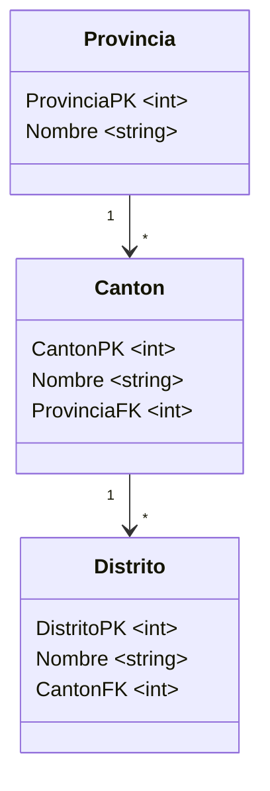

# Tarea Programada 4

| Curso                           | Programación Avanzada en Web     |
| :------------------------------ | :------------------------------- |
| Código                          | SC-701                           |
| Profesor                        | Luis Andrés Rojas Matey          |
| Fecha y hora de entrega inicial | Martes 8 de julio a las 9:00 pm  |
| Fecha y hora de entrega final   | Martes 15 de julio a las 6:00 pm |
| Valor                           | 4 %                              |

<br />

## Introducción

El territorio costarricense se divide adminitrativamente en provincias, las cuales tienen cantones y estos, a su vez, contienen distritos.

<br />

## Objetivo

Aplicar los conocimientos adquiridos al utilizar la herramienta `Entity Framework` con la estrategia denominada _Code First_, además de investigar cómo lograr la lectura y escritura de archivos CSV (_comma-separated values_), utilizando el _framework_ `.NET 8.0`.

<br />

## Especificaciones funcionales

Se debe crear una aplicación de Consola, capás de cumplir con las siguientes actividades:

1. Crear una base de datos relacional

2. Utilizar el archivo CSV provisto

3. Guardar archivos CSV

<br />

### Crear una base de datos relacional

El objetivo de esta sección es que el proyecto incluya todo lo necesario para la creación de una base de datos relacional de `SQLite` por medio de la estrategia _Code First_. Esto significa que se debería poder ejecutar las siguientes instrucciones y la base de datos se crearía satisfactoriamente:

```bash
$ dotnet build
...
$ dotnet ef migrations add InitialCreate
...
$ dotnet ef database update
```

Lo anterior implica que los paquetes de **NuGet** tanto del `Entity Framework` como de `SQLite` deben estar referenciados en el archivo del proyecto (`.csproj`).

Además, la base de datos se deberá llamar `CR.db` y crearse dentro de una carpeta llamada `data` en la raíz del directorio del _project_ (no del _solution_).

Como se debe utilizar la estrategia _Code First_, debe existir una única clase _Context_ (con cualquier nombre) que contenga _Entities_ que correspondan con la siguiente estructura (como se puede observar, el sufijo **PK** significa _Primary Key_, y el **FK** corresponde a _Foreign Key_, así como que las tildes fueron suprimidas):



Como parte del proceso de creación de la base de datos, se deben hacer varios cambios a las convenciones de `Entity Framework`:

- Agregar _annotations_ en cada una de las tablas para indicar que las propiedades con el sufijo **PK** corresponden a las _Primary Keys_ en la base de datos.

- Utilizar la estrategia de _Fluent API_ para que en la base de datos las columnas correpondientes al _property_ **Nombre** contengan como prefijo el nombre de la clase. Por ejemplo, la columna **Nombre** de la base de datos correspondiente a la clase **Provincia** se deberá llamar **ProvinciaNombre**. Tomar en cuenta que este cambio se debe hacer para las tres tablas.

- Utilizar cualquier estrategia (ya sea por medio de _annotations_ o de _Fluent API_) para indicar que las propiedades con sufijo **FK** corresponde a las _Foreign Keys_.

<br />

### Utilizar el archivo CSV provisto

Desde la misma carpeta `data`, se debe poder leer el archivo CSV proveído, es decir, suponer que el `CR.csv` estará en dicha carpeta. Este archivo fue obtenido y modificado a partir de un documento de [SNIT](https://files.snitcr.go.cr/boletines/DTA-TABLA%20POR%20PROVINCIA-CANT%C3%93N-DISTRITO%202022V3.xlsx) y contiene una lista de distritos, con su correspondiente cantón y provincia (importante aclarar que dicha información administrativa no está actualizada). Se puede observar que el archivo contiene un encabezado con tres columnas y las demás filas corresponden a los datos:

```
Provincia,Cantón,Distrito
San José,San José,Carmen
San José,San José,Merced
San José,San José,Hospital
...
```

Cuando se ejecuta el programa (de Consola), lo primero que debe hacerse es verificar si la base de datos tiene la información guardada. De no ser así (es decir, la primera vez que se ejecuta), entonces se debe llenar la base de datos con la información del archivo `CR.csv`.

Se puede suponer que la base de datos fue creada con anterioridad, es decir, se debe verificar que la base de datos está vacía (sin información), no que el archivo de la base datos (`CR.db`) exista. Además, el llenado de la base de datos solo debería efectuarse una sola vez. Por ejemplo, cuando se ejecute la primera vez la aplicación de Consola, se debe indicar que la base de datos está vacía y, por lo tanto, se debe llenar con la información correspondiente (los mensajes son solo de referencia):

```bash
$ dotnet run

La base de datos está vacía, por lo que debe ser llenada a partir de los datos del archivo CSV.

Procesando... Listo.
```

<br />

### Guardar archivos CSV

Cuando el programa (de Consola) se ejecuta de nuevo (porque la base de datos ya fue llenada con la información), este debe indicarle al usuario que escoja una provincia por medio de su identificador numérico (autogenerado). Para esto, debe listar tanto el identificador como el nombre de las **Provincias**.

Una vez escogida la provincia, se debe listar los **Cantones** asociados a esta, también con el identificador y el nombre. Cuando el usuario escoge el cantón, se generará dentro de la carpeta `data` un archivo CSV de la siguiente manera:

- El nombre del archivo corresponde a los indentificadores de la provincia y el cantón separados por el símbolo `-`. Ejemplo: `1-7.csv`.

- La información del archivo debe ser la lista de distritos con sus correspondientes cantón y provincia, de esta forma: la primera fila debe contener los nombres de las tres columnas y, a partir de la segunda fila, los nombres de los distritos con la repetición del cantón y la provincia. Por ejemplo:

```
Provincia,Cantón,Distrito
San José,Montes de Oca,San Pedro
San José,Montes de Oca,Sabanilla
San José,Montes de Oca,Mercedes
San José,Montes de Oca,San Rafael
```

A manera de ejemplo, algo similar a esto se debería desplegar en la Consola cuando el programa se ejecuta la segunda y demás veces:

```
$ dotnet run

Provincias:

1. San José
2. Alajuela
3. Cartago
4. Heredia
5. Guanacaste
6. Puntarenas
7. Limón

> Indique la provincia: 1

Cantones:

1. San José
2. Escazú
3. Desamparados
4. Puriscal
5. Tarrazú
6. Aserrí
7. Montes de Oca
8. Goicoechea
9. Santa Ana
...

> Indique el cantón: 7

Generando y guardando el archivo 1-7.csv... Listo
```

<br />

## Especificaciones técnicas

- El trabajo debe realizarse con el lenguaje de programación `C#`, la herramienta `Entity Framework 9.0` y el _framework_ `.NET 8.0`.

- Debe contener un _solution_ y un _project_, así como el _project_ incluido en el _solution_.

- La base de datos [`SQLite`](https://www.sqlite.org) debe ser versión **3**. Se recomienda el uso de la herramienta [DB Browser for SQLite](https://sqlitebrowser.org) para su visualización.

- Se recomienda utilizar el editor [Visual Studio Code](https://code.visualstudio.com).

<br />

## Entregables

Al ser una tarea individual, se debe entregar un único archivo comprimido **ZIP** con el siguiente nombre: `TP4-[Carné].zip`. Ejemplo de nombre del archivo **ZIP**: `TP4-FH12345678.zip`.

El mismo debe contener lo siguiente:

- Todo el código fuente que incluya el archivo _solution_ y la carpeta del _project_. Sin embargo, no debe contener los archivos compilados, es decir, excluir las carpetas `bin` y `obj`.

- Las carpetas `Migrations` y `data` (con sus correspondientes archivos) deben también excluirse.

- La documentación en un archivo [Markdown](https://www.markdownguide.org) llamado `README.md`, donde se indique lo siguiente:

  - Su nombre, carné y el enlace al repositorio si lo subió a `GitHub`, `GitLab` o algún otro proveedor.

  - Los comandos de `dotnet` utilizados (**CLI**).

  - Páginas web donde halló posibles soluciones a problemas encontrados o _snippets_ de código.

  - _Prompts_ (consultas y respuestas) de los _chatbots_ de IA (`Copilot`, `Gemini`, `ChatGPT`, etc.) que haya utilizado.

<br />

## Evaluación

El proyecto será calificado según la rúbrica que se presenta en el programa del curso.
